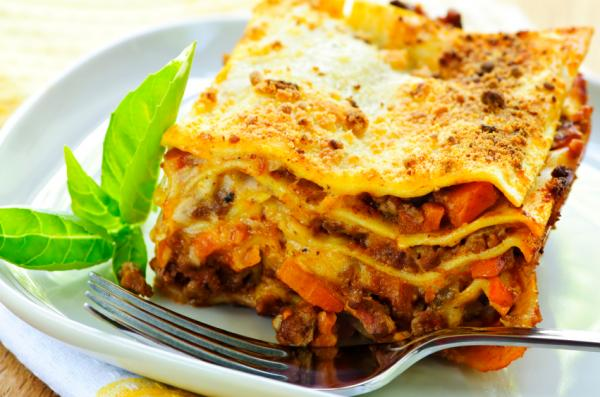
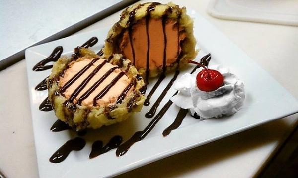
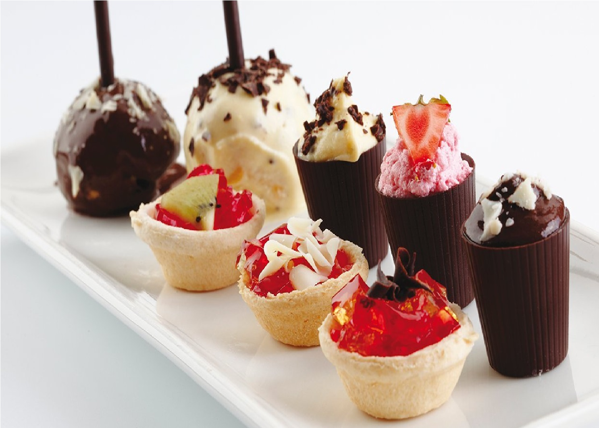
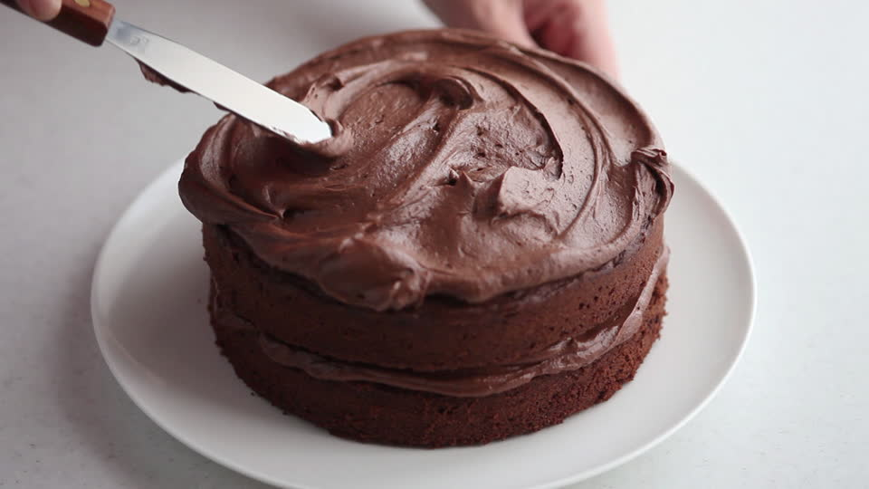
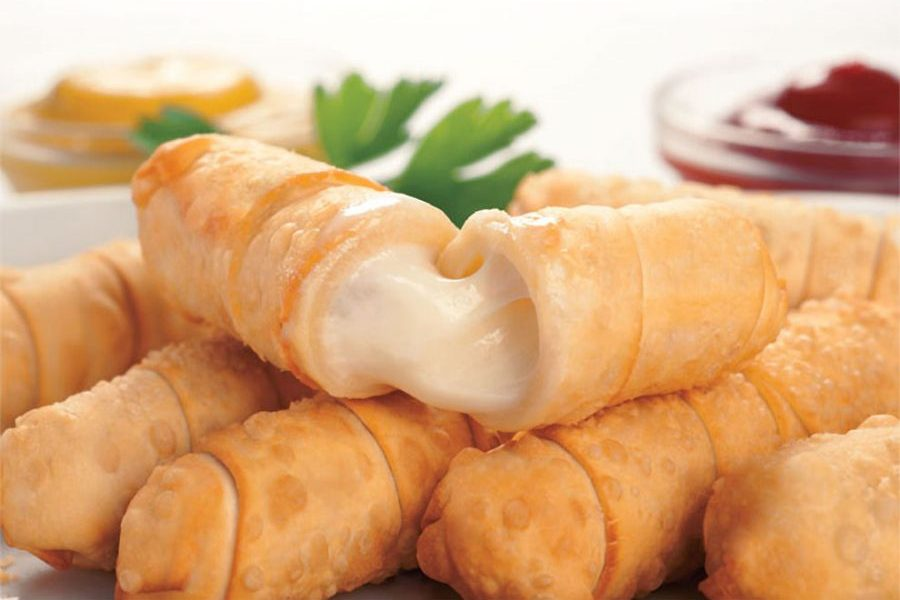
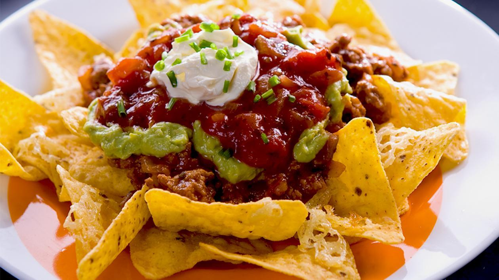
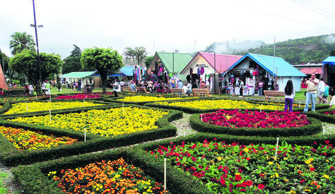

<!DOCTYPE html>
<html>

<head>
    <title>index</title>
    <link rel="stylesheet" href="foundation/foundation.css" />
</head>

<body>
        <!--ESte seria el bloque de la izquierda-->
        

            <h1 class="text-left" style="color: white">Comida internacional</h1>
            <h3 class="text-left" style="color: white">prepara lo que quieras sin importar en que pais te encuentres</h3>
            <!--Saque el buscar del grupo de botones para que ocupe todo el ancho de la columna-->
            

                

                    <input class="input-group-field" type="text">
                    

                        <button type="submit" class="button">
              <i class="step fi-magnifying-glass"></i><!--Estee icono no cargar por te falta añadir el css de iconos de foundation-->
            </button>
                    

                

            

            

                

                    <a class="button">desalluno, almuerzo y cena</a>
                    <a class="button">snacks</a>
                    <a class="button">postres</a>
                

            

            

                

                

                

            

            

                

                

                

            

            <ul class="vertical menu">
                <li><a href="#">Tamales</a></li>
                <li><a href="#">Pasticho</a></li>
                <li><a href="#">Limonada</a></li>
                <li><a href="#">Helado</a></li>
                <li><a href="#">Empanadas</a></li>
                <li><a href="#">Torta</a></li>
                <li><a href="#">Pastel</a></li>
                <li><a href="#">Ensalada</a></li>
                <li><a href="#">Hamburguesa</a></li>
                <li><a href="#">Enchilada</a></li>
                <li><a href="#">Mole</a></li>
                <li><a href="#">Salsas</a></li>
                <li><a href="#">Arepas</a></li>
                <li><a href="#">Pastas</a></li>
                <li><a href="#">Pollo</a></li>
                <li><a href="#">Carnes</a></li>
                <li><a href="#">Pescados</a></li>
                <li><a href="#">Mariscos</a></li>
                <li><a href="#">Panesillos</a></li>
            </ul>
        

        <!--ESte seria el bloque de la derecha-->
        

            

                <h1 style="color: white"> Hielo de limonada </h1>
                <h2>publicado en 28/6/2019</h2>
                
 </img> 

                
 Instrucciones
                	Lleva el agua al fuego y disuelve el azúcar. Apaga y deja refrescar.
Combina el sirope con el jugo de limón en una jarra junto al agua.
Vierte la limonada en moldes de hielo y distribuye las rebanadas de limón y hierbas en las cavidades de los moldes.
Lleva al congelador hasta formar cubos de hielo firmes, mejor de un día para otro.
Sirve el agua con gas con los cubos de hielo de limonada.

<h4>Agregue un comentario</h4>
<textarea></textarea>
   <a class="button">publicar</a>
               <h1 style="color: white">Tamales panameños</h1>
               <h2>publicado en 28/6/2019</h2>
               
               

Cocine el maíz pelado hasta que quede suave. Se escurre y se enfría. Se deja escurrir, se muele y se reserva.
A parte, sofría la gallina con los pimientos (ajies), la cebolla, el cilantro, el ajo, la pimienta y la sal.
Luego agréguele la pasta de tomate, la salsa de tomate y el caldo concentrado. Se deja cocinar 10 minutos y luego, se le añade agua hasta que cubra bien la gallina. Se tapa y, a fuego lento, se deja cocer hasta que esté suave.
Colóquele las pasitas, las aceitunas y alcaparras, y se deja cocinar por 20 minutos más.
Finalmente, añádale los guisantes (petits-pois). Si tiene muy poca agua se le puede verter un poco más. 
Cocer hasta que los guisantes están cocidos. Cuélalo todo y agrega el caldo a la masa de maíz. Amasa bien hasta que quede todo bien repartido y suave.
Lave bien las hojas de plátano, luego introdúzcalas en una olla con agua hirviendo y escúrralas enseguida. Corte los hilos de pabilo, lo suficientemente largos que le alcance para amarrar el tamal.
En cada hoja se vierte un cucharón de masa, encima se pone una presa de gallina con las verduritas y luego se vierte medio cucharón más de masa, se envuelve y ata. Se repite este procedimiento hasta emplear toda la masa.
En una olla grande de agua hirviendo se introducen los tamales y se cocinan una hora. Al sacarlos quedan listos para servir.

<h4>Agregue un comentario</h4>
<textarea></textarea>
<a class="button">publicar</a>
            

        

    

</body>
<!DOCTYPE html>
<html>
<head>
		<title>index</title>
		<link rel="stylesheet" href="frameworks/bootstrap-4.3.1-dist/css/bootstrap.css">
		<link rel="stylesheet" type="text/css" href="css/mi css.css">
		<meta name="viewport" content="width=device-width, initial-scale=1">
		
</head>
<body style="background-color: #F8EAA4">
	<header style="background-color: #A00909; ">

	

		
	

	

		
		
		 

  	 <ul style="text-align: right;" class="nav justify-content-center">
  <li class="nav-item">
    <a class="nav-link active" href="#">Inicio</a>
  </li>
  <li class="nav-item">
    <a class="nav-link" href="#">System of a Down</a>
  </li>
  <li class="nav-item">
    <a class="nav-link" href="#">Slipknot</a>
  </li>
<a class="nav-link" href="#">Conciertost</a>
  </li>
<a class="nav-link" href="#">Merchandasing</a>
  </li>
</ul>

</header>
  

		

			
La primera grabación de la banda se cree que fue un demo que contenía dos canciones: Flake y Toast. El primer demo no oficial es conocido como "The Untitled Demo Tape", que contenía los temas P.I.G. (demo de Mr. Jack), la primera versión de The Metro (cover del grupo Berlin), Flake y Toast. Otros temas que también se cree que fueron grabados en ese tiempo son Roulette, 36 y X, que después serían usados lanzamientos oficiales de System, además de Friik, Blue, Storaged y Marmalade.

En 1995 la banda lanzó su primer demo oficial, éste tenía muy baja calidad y solo era vendido en sus presentaciones. El demo contenía Dam, Sugar, Suite-Pee y P.L.U.C.K., estas 3 últimas fueron utilizadas en el primer álbum homónimo de la banda. La banda seguía dando conciertos y escribiendo nuevo material, y en 1996 salió a la luz su segundo demo. Este tenía mucha mejor calidad que el anterior, y contenía las canciones Honey, Temper y Soil. La última fue utilizada para el primer álbum en 1998, las otras dos nunca fueron regrabadas, pero existen diversas versiones en vivo. En 1997 la banda grabó su tercer demo, que contenía Peephole, Know y War. Existe otra versión promocional de este demo, que estuvo a la venta sólo unos días y muy poca gente compró. La diferencia es que éste demo contenía una canción más, que no había sido listada, al parecer durante la grabación del demo fue como una "improvisación". Esta canción se filtró en Internet apenas en 2009, cuando un fan la descubrió y decidió compartir la noticia. La canción es conocida como "The Missing Song"

		

			

				

				<input style="width: 750px; background-color: blue; color:white"  type="Buscador" name="Buscador">
				
<a href="">canciones destacadas</a>

				
<a href="">listado de canciones</a>

				
<a href="">miembros de Slipknot</a>

				
<a href="">miembros de System of a Down</a>

				
<a href="">manager de Slipknot</a>

				
<a href="">manager de System of a Down</a>

				
<a href="">giras anteriores</a>

				
<a href="">fecha de proximas giras</a>

			   

			   
			   <textarea style="width: 600px "></textarea>
		    

			   
	 

    

		

			
		

		

			
En agosto de 2009, Slipknot ganó dos premios Kerrang!, mejor banda en directo, y mejor banda internacional. Fue confirmado por Corey que la banda se tomaría otro breve descanso después de All Hope Is Gone World Tour, para que pueda volver a grabar con Stone Sour y también para trabajar en su álbum en solitario. El 17 de septiembre Clown reveló que estaba escribiendo un libro titulado The Apocalyptic Nightmare Journey, donde relata su relación con la banda, aunque no hay fecha oficial de puesta en venta. También ha expuesto en su propia galería de arte, donde están a la venta sus cuadros y fotografías
Slipknot ha confirmado una actuación en la primera celebración anual Trinity of Terrors, que tendrá lugar en el Palms Resort Casino el 31 de octubre (coincidiendo con Halloween).

El 24 de mayo de 2010, el bajista Paul Gray fue encontrado muerto, a causa de una sobredosis accidental de morfina, alrededor de las 10:50 a. m. en una habitación de un hotel de Des moines en el estado de Iowa, Estados Unidos.

Durante una entrevista antes del debut de la banda en Sonisphere en los Países Bajos, el percusionista Chris Fehn declaró que el grupo estaba haciendo un nuevo álbum que será lanzado en 2010, aproximadamente. La banda también ha confirmado una nueva edición conmemorando el décimo aniversario de su homónimo álbum debut, que incluirá todas las pistas de la versión original, así como varias demos, remixes y la canción Purity. También saldrá a la venta un nuevo DVD, titulado Of the (Sic): Your Nightmares, Our Dreams, que contendrá material de 1999-2000.

<textarea style="width: 600px "></textarea>
		

  	    
     

  	 

			</ul>
 	 

 	

 	

</body>
<!DOCTYPE html>
<html>
 <head>
  <link href="https://fonts.googleapis.com/icon?family=Material+Icons" rel="stylesheet">
  <link type="text/css" rel="stylesheet" href="css/materialize.min.css"  media="screen,projection"/>
  <link rel="stylesheet" type="text/css" href="lol/lol.css">
      <meta name="viewport" content="width=device-width, initial-scale=1.0"/>
    </head>

    <body>
    	<header>
            </img>
              <a href="#" id="btn" class="btn waves-effect orange boton-menu"><i class="material-icons left">store</i>Inicio</a>
              <a href="#" id="btn" class="btn waves-effect orange botton menu"><i class="material-icons left">room</i>donde estuve</a>
              <a href="#" id="btn" class="btn waves-effect orange botton menu"><i class="material-icons left">grade</i>viajes</a>
              <a href="#" id="btn" class="btn waves-effect orange botton menu"><i class="material-icons left">chat_bubble_outline</i>recomendaciones</a>
         </header>
         

         	

         		

         			<h2 class="center-align slogan">El mejor viaje es el que disfrutas con familia y amigos</h2>
         		

         	

         	

</img>

</img>

</img>

    

      

        
      

      

        
      

    

    

      

        
      

    

    

      

        
      

      

        
      

    

  

         

<h4>La gran sabana</h4> 

Fecha de publicación: 10/5/2017 -- Número de comentarios: 3

  La Gran Sabana ofrece al visitante paisajes únicos en todo el mundo, cuenta con ríos, cascadas y quebradas, valles profundos y extensos, selvas impenetrables, y sabanas que alojan una gran cantidad y variedad de especies vegetales, una fauna diversa, y las mesetas de arenisca mejor conocidas como tepuyes

  

  

          <input  id="first_name" type="text" class="validate">
          <label for="first_name">First Name</label>
        

        

          <input id="last_name" type="text" class="validate">
          <label for="last_name">Last Name</label>
        

      

      

        

          <textarea row="4" id="disabled" type="text"  class="materialize-textarea validate" > </textarea>
          <label for="disabled">Comentario</label>
        

      
  
      <button class="btn waves-effect waves-light" type="submit" name="action">Submit
    <i class="material-icons right">send</i>
  </button>

 

<h4>La cascada de jaspe</h4> 

Fecha de publicación: 16/7/2017 -- Número de comentarios: 1

 Quebrada de Jaspe​ es el nombre que recibe un río y una serie de Cascadas o caídas de agua en el país suramericano de Venezuela.​ Se localizan específicamente en el sector oriental del Parque nacional Canaima, en el Municipio Gran Sabana

  

  

          <input  id="first_name" type="text" class="validate">
          <label for="first_name">First Name</label>
        

        

          <input id="last_name" type="text" class="validate">
          <label for="last_name">Last Name</label>
        

      

      

        

          <textarea row="4" id="disabled" type="text"  class="materialize-textarea validate" > </textarea>
          <label for="disabled">Comentario</label>
        

      
  
      <button class="btn waves-effect waves-light" type="submit" name="action">Submit
    <i class="material-icons right">send</i>
  </button>

 

      
    </body>
